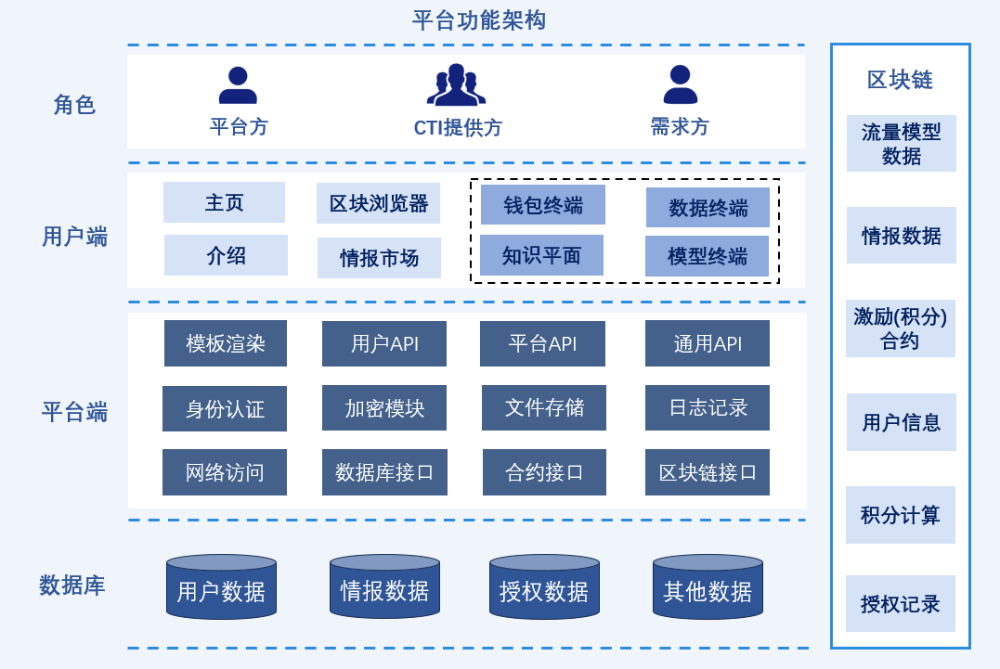
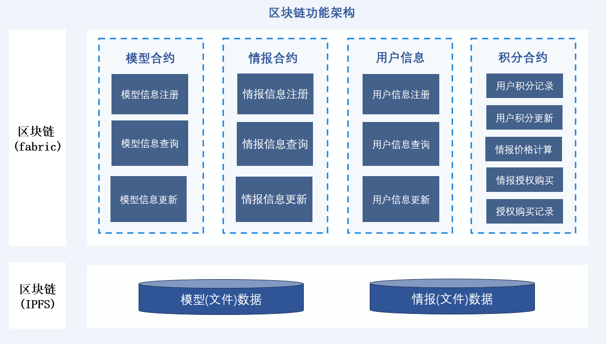
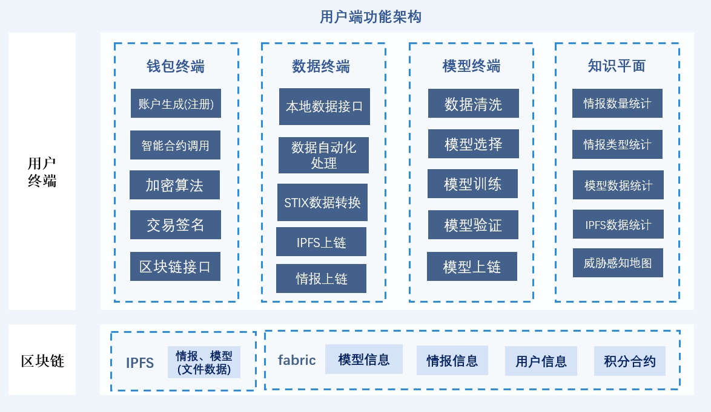

## CTI 共享平台(Client)端开发说明

### 1.整体架构

#### 1.1 平台功能架构

#### 1.2 区块链功能架构

#### 1.3 用户端功能架构

### 2.开发注意事项

#### 2.1 开发环境

| 环境名 | 版本  | 描述              |
| ------ | ----- | ----------------- |
| python | 3.7.5 | 至少 python3 以上 |

##### 2.2 依赖库

| 依赖    | 描述                                                             |
| ------- | ---------------------------------------------------------------- |
| tinyDB  | 一个轻量级 JSON 数据库，可以存储 JSON 数据在本地，并支持增删改查 |
| asyncio | python 默认协程库，客户端一些功能需要依赖线程和协程实现          |

#### 2.3 Git 提交与推送

1. 提交代码时，请确保代码已编译通过，并且没有出现任何警告。
2. 拉取和提交方式查看 readme.md 文档

### 3.智能合约接口

#### 3.1 模型合约

##### 3.1.1 模型合约信息

| 链码名称(cc_name) | 管道(channel_name) | 节点组织(peers)        |
| ----------------- | ------------------ | ---------------------- |
| model_chaincode   | mychannel          | peer0.org1.example.com |

##### 3.1.2 模型对象字段信息(model_info)

| 字段名               | 类型      |                描述                |
| -------------------- | --------- | :--------------------------------: |
| model_id             | string    |        模型 ID，由合约生成        |
| model_name           | string    |              模型名称              |
| creator_user_id      | string    |           创建者用户 ID           |
| traffic_type         | string    | 流量类型(卫星网络、SDN、5G、IP 等) |
| traffic_features     | string[]  |         流量数据集特征字段         |
| traffic_process_code | string    |   流量特征处理的代码地址(GitHub)   |
| ml_method            | string    | 模型方法(SVM、聚类、CNN、LSTM 等) |
| ml_info              | string    |    模型详细配置信息(JSON 格式)    |
| ml_train_code        | string    |     模型训练代码的地址(Github)     |
| ipfs_hash_address    | string    |    模型存储的 IPFS 地址(如果有)    |
| ref_cti_id           | string    |           索引的 CTI ID           |
| create_time          | timestamp |             由合约创建             |

##### 3.1.3 合约函数接口

| 接口名             | 合约函数                   | 描述                                                                                             | 参数                                                                                       | 返回值 |
| ------------------ | -------------------------- | ------------------------------------------------------------------------------------------------ | ------------------------------------------------------------------------------------------ | ------ |
| 函数调用 申请 | getTransactionNonce        | 使用交易签名 获取交易随机数                                                                 | String:user_id String:tx_signature                                                    |        |
| 模型信息 注册 | registerModelInfo          | 上传模型的基本参数， 需要私钥签名 (对 model_info 进行 SHA256 后的 hash 签名) | String:user_id Object:model_info String:tx_signature String:nonce_signature |        |
| 模型信息 查询 | queryModelInfo             | 根据 ID 查询模型信息                                                                             | String:model_id                                                                            |        |
| 模型分页 查询 | queryModelInfoList         | 分页查询                                                                                         | page:int page_size:int                                                                |        |
| 模型分类 查询 | queryModelInfoList         | 按照流量类型分类查询                                                                             | page:int page_size:int type:string                                               |        |
| 用户模型 查询 | queryModelInfoListByUserID | 根据用户 ID 查询模型                                                                             | page:int page_size:int user_id:string                                            |        |
| 情报模型 查询 | queryModelInfoListByCtiID  | 根情报 ID 查询模型                                                                               | page:int page_size:int cti_id:string                                             |        |

#### 3.2 情报合约

##### 3.2.1 情报合约信息

| 链码名称(cc_name) | 管道(channel_name) | 节点组织(peers)        |
| ----------------- | ------------------ | ---------------------- |
| cti_chaincode     | mychannel          | peer0.org1.example.com |

##### 3.2.2 情报对象字段信息(cti_info)

| 字段名           | 类型      |                    描述                    |
| ---------------- | --------- | :-----------------------------------------: |
| cti_id           | string    |             情报 ID，由合约生成             |
| cti_name         | string    |                  情报名称                  |
| cti_type         | int       |     情报类型(1-10，10 是流量类型的情报)     |
| cti_traffic_type | int       | 流量情报(0:非流量、1:卫星网络、2:5G、3:SDN) |
| open_source      | int       |          是否开源(0:不开源,1:开源)          |
| creator_user_id  | string    |                  创建者 ID                  |
| tags             | string[]  |                情报标签数组                |
| iocs             | string[]  |     包含的沦陷指标(IP、端口、URL、HASH)     |
| stix_data        | string    |      STIX 数据(JSON 格式)，可以有多条      |
| description      | string    |                  情报描述                  |
| data_size        | int       |                 数据大小(B)                 |
| data_hash        | string    |            情报数据 HASH(SHA256)            |
| ipfs_hash        | string    |              IPFS 地址(如果有)              |
| need             | int       |                 情报需求量                 |
| value            | int       |           情报价值(积分),合约生成           |
| compre_value     | int       |     综合价值(积分激励算法定价),合约生成     |
| create_time      | timestamp |          情报创建时间(由合约生成)          |

##### 3.2.3 合约函数接口

| 接口名       | 合约函数                 | 描述                                                                                                           | 参数                                                                                     | 返回值 |
| ------------ | ------------------------ | -------------------------------------------------------------------------------------------------------------- | ---------------------------------------------------------------------------------------- | ------ |
| 函数调用申请 | getTransactionNonce      | 使用交易签名 获取交易随机数                                                                               | String:user_id String:tx_signature                                                  |        |
| 情报信息注册 | registerCTIInfo          | 情报的的基本参数 (部分由合约生成)， 需私钥签名( 数据 HASH 的签名、 交易随机数的签名 ) | Object:cti_info String:user_id String:tx_signature String:nonce_signature |        |
| 情报信息查询 | queryCTIInfo             | 根据 ID 查询情报信息                                                                                           | String:cti_id                                                                            |        |
| 情报分页查询 | queryCTIInfoList         | 分页查询                                                                                                       | page:int page_size:int                                                              |        |
| 情报分类查询 | queryCTIInfoList         | 按照类型分类查询 (如查询流量类型的情报 type:0)                                                       | page:int page_size:int type:string                                             |        |
| 用户情报查询 | queryCTIInfoListByUserID | 根据用户 ID 查询用 户已上传的情报                                                                         |                                                                                          |        |

#### 3.3 用户信息合约

##### 3.3.1 用户合约信息

| 链码名称(cc_name) | 管道(channel_name) | 节点组织(peers)        |
| ----------------- | ------------------ | ---------------------- |
| user_chaincode    | mychannel          | peer0.org1.example.com |

##### 3.3.2 用户信息对象(user_info)

| 字段名          | 类型      |           描述           |
| --------------- | --------- | :-----------------------: |
| user_id         | string    | 用户 ID，公钥的 SHA256 值 |
| user_name       | string    |     用户名(英文字母)     |
| public_key      | string    |         用户公钥         |
| public_key_type | string    |    公钥类型(RSA、SM2)    |
| value           | int       |         积分数量         |
| create_time     | timestamp | 用户注册时间(由合约生成) |

##### 3.3.2 合约函数接口

| 接口名       | 合约函数            | 描述                                                                         | 参数                                                                                      | 返回值 |
| ------------ | ------------------- | ---------------------------------------------------------------------------- | ----------------------------------------------------------------------------------------- | ------ |
| 函数调用申请 | getTransactionNonce | 使用交易签名 获取交易随机数                                             | String:user_id String:tx_signature                                                   |        |
| 用户信息注册 | registerUserInfo    | 用户的基本参数 (部分由合约生成)                                         | Object:user_info                                                                          |        |
| 用户信息查询 | queryUserInfo       | 根据 ID 查询用户信息                                                         | String:user_id                                                                            |        |
| 用户信息更新 | updateUserInfo      | 更新用户信息， 需要私钥签名( 数据 hash 签名 、交易随机数签名) | String:user_id Object:user_info String:tx_signature String:nonce_signature |        |

#### 3.4 积分合约

##### 3.4.1 积分合约信息

| 链码名称(cc_name)    | 管道(channel_name) | 节点组织(peers)        |
| -------------------- | ------------------ | ---------------------- |
| user_point_chaincode | mychannel          | peer0.org1.example.com |

##### 3.4.2 积分信息对象(user_point_info)

| 字段名               | 类型                 |             描述             |
| -------------------- | -------------------- | :--------------------------: |
| user_point_map       | Map:stirng->int      |      用户 ID->积分映射      |
| user_cti_map         | Map:string->string[] | 用户 ID->购买的 CTI 列表映射 |
| cti_compre_value_map | Map:string->int      |   cti_id->CTI 综合价值映射   |
| cti_sale_map         | Map:string->int      |   cti_id->CTI 购买数量映射   |

##### 3.4.3 合约函数接口

| 接口名                 | 合约函数              | 描述                                                                                            | 参数                                                                                   | 返回值 |
| ---------------------- | --------------------- | ----------------------------------------------------------------------------------------------- | -------------------------------------------------------------------------------------- | ------ |
| 函数调用 申请     | getTransactionNonce   | 使用交易签名 获取交易随机数                                                                | String:user_id String:tx_signature                                                |        |
| 用户积分 信息注册 | registerUserPointInfo | 用户的基本参数 (部分由合约生成)                                                            | Object:user_info                                                                       |        |
| 用户积分 信息查询 | queryUserInfo         | 根据 ID 查询 用户信息                                                                      | String:user_id                                                                         |        |
| 用户购买 CTI      | purchaseCTI           | 用户使用积分 购买 CTI, 需要私钥签名( 数据 HASH 签名、 交易随机数签名 ) | String:cti_id String:user_id String:tx_signature String:nonce_signature |        |

### 4.任务 1(钱包终端)

#### 4.1 任务描述

使用 Fabric python SDK 编写钱包终端，要求实现的功能如下：

| 功能           | 要求                                                                   | 描述                                                                        |
| -------------- | ---------------------------------------------------------------------- | --------------------------------------------------------------------------- |
| 用户账户生成   | 在本地生成用户账户，并把证书(公私钥)存在 blockchain/wallet 文件夹 | 在本地生成用户账户(公私钥、证书)                                            |
| 用户信息上链   | 调用用户合约的 registerUserInfo 注册用户                               | 用户信息上链(包含用户公钥等信息)                                            |
| 加密算法       | 实现基本的加密算法                                                     | 实现常用的 AES、RSA、SM2 以及 HASH(SHA256)等算法， 可调用第三方库 |
| 交易签名       | 实现交易随机数获取接口、数据 HASH 签名、随机数签名                     | 部分合约调用需要使用私钥进行数据签名                                        |
| 区块链信息查询 | 查询区块链信息，包括(块高度、交易数量、 链码数量、最新 5 个交易)  | 使用 fabric python SDK 或者远程接口                                        |

此任务模块需要部署 Fabric 区块链，可先尝试在虚拟机上部署 Fabric，后期将在服务器上部署公共区块链服务。

#### 4.2 数据结构

| 字段名          | 类型      |           描述           |
| --------------- | --------- | :-----------------------: |
| user_id         | string    | 用户 ID，公钥的 SHA256 值 |
| user_name       | string    |     用户名(英文字母)     |
| public_key      | string    |         用户公钥         |
| public_key_type | string    |    公钥类型(RSA、SM2)    |
| value           | int       |         积分数量         |
| create_time     | timestamp | 用户注册时间(由合约生成) |

#### 4.3 接口要求

| 接口地址                             | 输入参数 | 描述(要求)                                                            | 返回参数                                                                          | 返回参数(示例) |
| ------------------------------------ | -------- | --------------------------------------------------------------------- | --------------------------------------------------------------------------------- | -------------- |
| /user/register-account               | 无       | 在本地生成账户的 公私钥， 用户 ID 为账户公钥 的 SHA256 | 用户注册成功信息                                                                  |                |
| /user/query-info                     | 用户 ID  | 用户信息对象                                                          | 返回链上用户信息对象                                                              |                |
| /blockchain/ query-info-summary | 无       | 查询区块链的信息                                                      | 返回区块链信息 (块高度、 交易数量、 链节点数、 最新 5 个交易) |                |

#### 4.4 服务函数接口

此处定义部分重要的函数接口，其他请根据需求实现，优先实现一下服务:

| 函数名              | 入参                                                                                                                           | 返回      | 描述                                                                                                |
| ------------------- | ------------------------------------------------------------------------------------------------------------------------------ | --------- | --------------------------------------------------------------------------------------------------- |
| getTransactionNonce | data:JOSN                                                                                                                      | nonce     | 需要先对data取SHA256的HASH， 调用链代码getTransactionNonce, 内部需要user_id(公钥的SHA256) |
| invokeChainCodeFunc | chaincode:string func_name:string user_id:string data:JOSN tx_signature:string nonce_signature:string | result    | 执行特定链码上的某函数，需要签名和 用户ID                                                      |
| rsaSignature        | priv_key:string data:string                                                                                               | signature | 使用用户的私钥对某个数据签名                                                                        |

### 5.任务 2(数据终端）

#### 5.1 任务描述

该模块负责对用户的本地数据进行处理转换成 STIX 格式，同时，转换后的 STIX 支持单独、批量上传到 Fabric 或 IPFS 上，该模块功能要求如下:

| 功能           | 要求                                                                            | 描述                                                         |
| -------------- | ------------------------------------------------------------------------------- | ------------------------------------------------------------ |
| 本地数据接口   | 对接本地日志、数据库、流量检测接口,针对 Linux 系统                              | 这个功能先不做，后期有需求再做                               |
| 数据自动化处理 | 使用 NLP 或者设计的算法自动转换流量日志等数据 为标准情报格式或者 STIX 格式 | 这个功能先不做，有能力可以自己调研 尝试                 |
| STIX 格式转换  | 流量数据集文件转换 STIX 格式 (单个文件或多条数据转换为一条 STIX)           | 可按标签划分 STIX，一个文件有几个标签 就有几条 STIX     |
| STIX 上链      | 调用智能合约接口 registerCTIInfo 进行 CTI 注册                                  | 需要 wallet_service 模块的功能， 优先实现链码调用的功能 |
| IPFS 上链      | 数据存到 IPFS 上，需要自己部署 IPFS 私有链，                                    | 数据量不大的话，可以考虑先不做                               |

#### 5.2 数据结构

#### 5.3 接口要求

| 接口地址                        | 输入参数       | 描述(要求)                                                                                         | 返回参数                                 | 返回参数(示例) |
| ------------------------------- | -------------- | -------------------------------------------------------------------------------------------------- | ---------------------------------------- | -------------- |
| /data/ process-csv-to-stix | 上传的POST文件 | 保存csv文件在data/csv目录 ，转换CSV文件为STIX, 文件规范命名并保存在 data/stix文件夹 | 转换后STIX的JSON 数据、文件本地地址 |                |
| /data/upload-chain              | cti_info对象   | STIX数据上链(单条),需要补充 cti_info的一些字段，比如HASH， 需要交易签名，以及调用合约，  | CTI的ID                                  |                |
| /data/upload-ipfs               | 无             | STIX文件数据上传IPFS                                                                               | IPFS上的HASH地址                         |                |

#### 5.4 服务函数接口

此处定义部分重要的函数接口，其他请根据需求实现，优先实现一下服务:

| 函数名           | 入参                 | 返回                 | 描述                                                                                                                             |
| ---------------- | -------------------- | -------------------- | -------------------------------------------------------------------------------------------------------------------------------- |
| processCsvToStix | 本地csv文件路径      | 处理后的STIX文件路径 | 把CSV流量数据集文件转STIX格式文件， 可能需要使用第三方威胁情报API补充一些字段, 比如，IP的威胁信息，端口涉及的CVE漏洞等 |
| uploadDataToIPFS | 处理后的STIX文件路径 | IPFS HASH地址        | 把威胁情报上传到IPFS，这部分需要部署IPFS， 可先实现其他功能.                                                                |

### 6.任务 3(模型终端)

#### 6.1 任务描述

改模块负责利用用户本地的流量数据集进行训练，训练完成后模型需保存在本地 ml/save 文件夹，减少工作量可先用sklean里面的模型，该模块功能要求如下:

| 功能     | 要求                                                                   | 描述                                                             |
| -------- | ---------------------------------------------------------------------- | ---------------------------------------------------------------- |
| 数据清洗 | 对前端传来的数据集 CSV 文件进行清洗，去除空值和异常值                  |                                                                  |
| 模型选择 | 根据前端传回的参数选择模型(SVM、聚类、CNN、LSTM等)                     | 可先设计几个简单模型，模型需要根据 数据集的特征字段动态适配 |
| 模型训练 | 模型训练并保存文件在 ml/save 文件夹， 规范命名(模型类型-Model_ID) |                                                                  |
| 模型测试 | 测试模型，并把所有训练测试数据保存在本地 TinyDB                        |                                                                  |
| 模型上链 | 模型数据存到 IPFS 上，需要自己部署 IPFS 私有链，或者其他方式           | 该部分有难度可优先实现其他功能                                   |

#### 6.2 数据结构

#### 6.3 接口要求

| 接口地址         | 输入参数                       | 描述(要求)                                                                                                                 | 返回参数           | 返回参数(示例) |
| ---------------- | ------------------------------ | -------------------------------------------------------------------------------------------------------------------------- | ------------------ | -------------- |
| /ml/precess-data | CSV文件                        | 清洗CSV文件，文件规范命名 并保存在ml/dataset文件夹                                                                    | 处理后文件本地地址 |                |
| /ml/train-model  | 本地文件地址 模型配置参数 | 根据配置训练模型，训练完成后 模型规范命名，保存在ml/save 文件夹,并保存训练时间进度在TinyDB， 以请求ID为主键 | 请求ID             |                |
| /ml/test-model   | 请求ID 模型本地地址       | 测试模型准确率等指标， 结果保存在TinyDB，以请求ID为主键                                                               | 请求ID             |                |
| /ml/model-status | 请求ID                         | 返回训练状态(进度、轮次)， 或者测试结果(准确率、F1分数等)                                                             | 训练状态、测试结果 |                |
| /ml/upload-ipfs  | 模型本地地址                   | 模型文件上传IPFS                                                                                                           | IPFS上的HASH地址   |                |

### 7.任务 4(知识平面)

#### 7.1 任务描述

`注:该部分统计功能由平台后端完成，用户端暂时不需要实现该部分功能。`

该模块主要对链上以及本地的一些 CTI 数据进行统计分析，然后输出归纳整理后的结果给前端，该模块功能要求如下:

| 功能          | 要求                                                                                               | 描述                                                      |
| ------------- | -------------------------------------------------------------------------------------------------- | --------------------------------------------------------- |
| 情报数量统计  | 需要查询链上的 STIX 数据数量                                                                       | 该功能需要对应链代码接口                                  |
| 情报类型统计  | 根据类型查询情报数量                                                                               | 该功能需要对应链代码接口                                  |
| 模型数据统计  | 查询链上模型数据信息并输出一些统计结果                                                             |                                                           |
| IPFS 数据统计 | 查询上传到 IPFS 上的数据信息(CTI、模型)并输出一些统计结果                                          |                                                           |
| 威胁感知地图  | 根据公开类型的 STIX 里的 IP 等字段，记录地理位置、 国家、攻击类型等数据、然后输出标准化的格式 | 需要依赖非加密的 STIX 数据, 链码会对部分数据进行统计 |

#### 7.2 数据结构

#### 7.3 接口要求

| 接口地址                 | 输入参数 | 返回参数                                                                                                         | 返回参数(示例) |
| ------------------------ | -------- | ---------------------------------------------------------------------------------------------------------------- | -------------- |
| /kp/cti-num-statistics   | 无       | 链上CTI数量                                                                                                      |                |
| /kp/cti-type-statistics  | 无       | 链上不同类型CTI(数量、类型比例)                                                                                  |                |
| /kp/cti-model-statistics | 无       | 模型数据统计(数量、类型比例)                                                                                     |                |
| /kp/ipfs-statistics      | 无       | IPFS上链统计(数量、类型比例)                                                                                     |                |
| /kp/cti-latest           | 无       | 最新的20个开源CTI详细信息， 包括LOC：IP、端口、HASH 地区、攻击类型、涉及漏洞、 出现时间等         |                |
| /kp/threat-sense-map     | 无       | 最近1-7天的CTI数据统计， 统计IP的地理位置， 不同类型攻击的时间段数量， 源地址和目的地址的地理坐标 |                |
